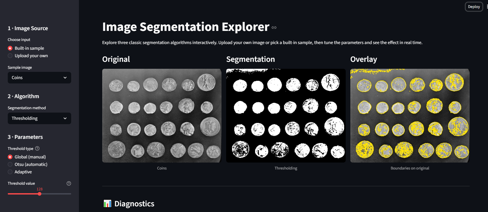

# Interactive Image Segmentation Explorer

**Assignment 2 — Image Analysis Course, University of Bern**

An interactive Streamlit app that teaches three classic image segmentation algorithms through hands-on exploration.

---

## Overview

This app lets you compare three segmentation methods side-by-side:

| Method | Idea | Best for |
|---|---|---|
| **Thresholding** | Separate foreground/background by intensity | Simple, high-contrast images |
| **K-Means Clustering** | Group pixels by intensity similarity | Multi-region, textured images |
| **Watershed** | Flood-fill from seed markers in a gradient landscape | Touching/overlapping objects |

For each method you can tune the key parameters and immediately see the effect on segmentation, overlay, and diagnostic plots.

---

## Local Setup

```bash
# 1. Clone / download this repo
cd segmentation_app

# 2. Create a virtual environment (optional but recommended)
python -m venv .venv
source .venv/bin/activate   # Windows: .venv\Scripts\activate

# 3. Install dependencies
pip install -r requirements.txt

# 4. Run
streamlit run app.py
```

The app opens at `http://localhost:8501`.

---

## Hugging Face Space

**Live demo:** `https://huggingface.co/spaces/guillemarin08/segmentation-explorer`


---

## Screenshots



---

## Project Structure

```
segmentation_app/
├── app.py                  # Streamlit UI — layout, controls, display
├── processing.py           # Thresholding, K-Means, Watershed algorithms
├── metrics.py              # Quantitative diagnostics
├── utils.py                # Image loading, overlay, histogram plotting
├── Dockerfile              # Docker config for Hugging Face deployment
├── requirements.txt
├── README.md
├── .streamlit/
│   └── config.toml         # Streamlit server configuration
├── screenshots/
│   └── image.png
└── docs/
    └── design_choices.md
```

---

## Known Limitations

- Images are converted to **grayscale** before segmentation. Colour-based segmentation (e.g. HSV thresholding) is not implemented.
- K-Means is **non-deterministic** but `random_state=42` is fixed, so results are reproducible for the same image and parameters.
- Watershed can be **slow on large images** (>1 MP). The app caps images at 512 px to keep it responsive.
- Adaptive thresholding block size must be **odd**; the app corrects this silently.
- No ground-truth masks are available, so overlap metrics (Dice/IoU) are not computed.
- File upload is disabled in the Hugging Face Space due to platform restrictions. Use the built-in sample images or run locally to test uploads.